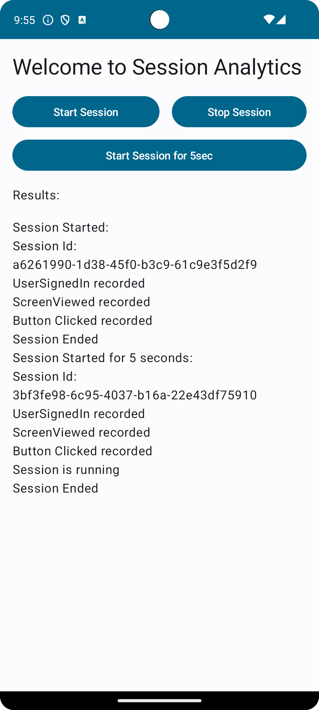

# SessionAnalytics

This project is a simple example of how to manage sessions and events using an Android SDK module.
It includes analytics tracking, Room database integration, and more.

## Features

- **Session Management**: Track user sessions with start and end times.
- **Event Recording**: Record events with customizable properties.
- **Database Integration**: Cache events locally using Room.

## Demo



## How to Use

1. Clone the repository.
2. Add the dependency to your project.
3. Follow the setup instructions in the implementation.

## Implementation

# Initialise SessionAnalytics in App

```kotlin
class SessionApp : Application() {
    override fun onCreate() {
        super.onCreate()
        SessionAnalytics.initialize(this)
    }
}
```

# Start the session

```kotlin
SessionAnalytics.startSession()
```

# Record the event with properties

```kotlin
SessionAnalytics.recordEvent(
                "userSignedIn",
                mapOf("userId" to "12345", "loginMethod" to "Google")
            )
```

# Stop the session

```kotlin
SessionAnalytics.endSession()
```


